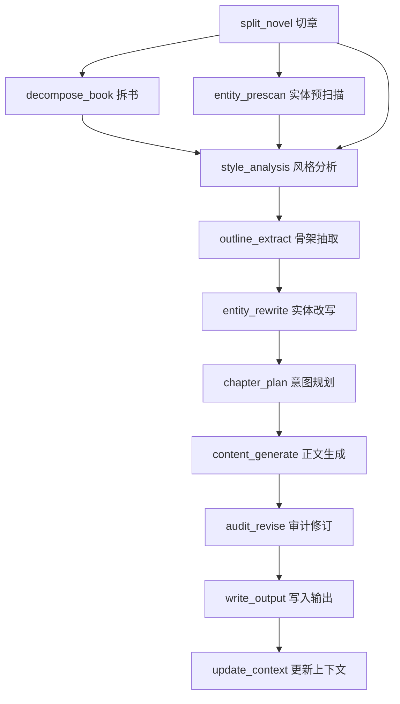

## 需求概述

当前项目是一个小说章节同结构改编工具，具有致命缺陷：缺乏拆书功能和工作流编排能力。需要进行两大改造：

### 一、新增拆书功能

根据原小说文本，自动分析生成以下设定文档：

- **世界观设定**：故事发生的世界背景、地理、历史、文化等
- **力量体系**：修炼、战斗、能力等系统的规则和等级
- **金手指设定**：主角独有的特殊能力、外挂、优势
- **主角档案**：主角性格、背景、动机、成长弧线
- **主要对手**：反派/对手阵营、动机、能力、与主角的关系
- **分卷规划**：按情节节点划分卷册，规划每卷核心事件
- **伏笔系统**：已埋伏笔、回收计划、悬念管理
- **写作风格指南**：原作语言风格、叙事技巧、文风特征
- **核心冲突**：贯穿全书的核心矛盾和主题

### 二、工作流改造

将现有线性处理流程改造为基于 DAG 的工作流系统：

- 每个处理步骤为独立节点，可单独运行和调试
- 节点间依赖关系可视化
- 有状态执行：保存进度、中断后可恢复
- 实时进度条 + 最终汇总报告
- 完全替换现有单章处理模式

## 技术方案

### 技术栈

- **语言**: Python 3.x（与现有项目一致）
- **进度展示**: rich 库（终端进度条、表格、面板）
- **持久化**: JSON 文件（工作流状态、拆书结果）
- **LLM**: 复用现有 llm/client.py 的 call_deepseek_api 接口
- **无外部工作流引擎依赖**：自研轻量 DAG 引擎，保持项目零额外依赖特性

### 系统架构

#### 工作流引擎核心

采用自研轻量 DAG 引擎，核心组件：

1. **TaskNode（任务节点）**: 封装单个处理步骤，定义输入/输出/执行逻辑
2. **DAG（有向无环图）**: 管理节点间依赖关系，支持拓扑排序
3. **StateStore（状态存储）**: JSON 持久化，支持保存/恢复进度
4. **ProgressTracker（进度追踪）**: 基于 rich 的实时进度条和汇总报告

#### DAG 任务图定义



#### 拆书功能实现

拆书（decompose_book）作为工作流中的独立节点：

- 读取已切好的章节文件（或原始全文）
- 通过多个 LLM 调用分别分析各维度设定
- 支持采样分析（前N章+中间+末尾）以控制 token 消耗
- 输出结构化 JSON + 可读 Markdown 报告
- 结果自动注入后续章节处理的上下文

### 实现要点

#### 1. 工作流状态管理

```
workflow_state.json {
    "run_id": "uuid",
    "status": "running|completed|failed|paused",
    "created_at": "ISO timestamp",
    "dag": { 节点依赖定义 },
    "tasks": {
        "task_id": {
            "status": "pending|running|completed|failed|skipped",
            "started_at": "...",
            "completed_at": "...",
            "duration_seconds": 0,
            "inputs": { ... },
            "outputs": { ... },
            "error": "..."
        }
    }
}
```

#### 2. 任务节点抽象

每个 TaskNode 实现统一接口：

- `id`: 唯一标识
- `name`: 显示名称
- `deps`: 依赖的任务 ID 列表
- `execute(context) -> result`: 执行逻辑
- `validate_inputs(context) -> bool`: 输入验证
- `can_skip(context) -> bool`: 是否可跳过（如已完成）

#### 3. 拆书分析维度

每个维度独立 LLM 调用，避免单次 prompt 过长：

- 世界观与力量体系 → 一次调用
- 主角档案与主要对手 → 一次调用
- 金手指设定与核心冲突 → 一次调用
- 伏笔系统与分卷规划 → 一次调用
- 写作风格指南 → 复用现有 style_analysis 模块逻辑

#### 4. 性能考量

- 拆书采样策略：默认取前3章+中间2章+末尾2章，可配置
- 工作流并发：初期串行执行，预留并发接口
- 状态增量保存：每完成一个节点立即落盘
- LLM 调用限速：复用现有 INTER_CHAPTER_SLEEP 配置

#### 5. 向后兼容

- 保留现有 config.py 所有配置项
- 复用 llm/、audit/、entity_rewriter.py 等模块
- 新增 workflow/ 子包，不破坏现有模块结构
- app.py 改为调用工作流引擎入口

本项目为命令行工具，不涉及前端 UI 设计。工作流可视化通过终端 rich 库实现：

- 进度条：rich.progress 展示整体和单步进度
- DAG 可视化：rich.tree 或 rich.table 展示节点状态和依赖
- 汇总报告：rich.panel + rich.table 展示最终执行统计
- 拆书结果：rich.markdown 渲染 Markdown 报告

## Agent Extensions

### SubAgent

- **code-explorer**
- Purpose: 在实现过程中深入探索现有代码模式和依赖关系，确保新代码与现有架构一致
- Expected outcome: 准确的代码定位和模式识别，减少实现错误